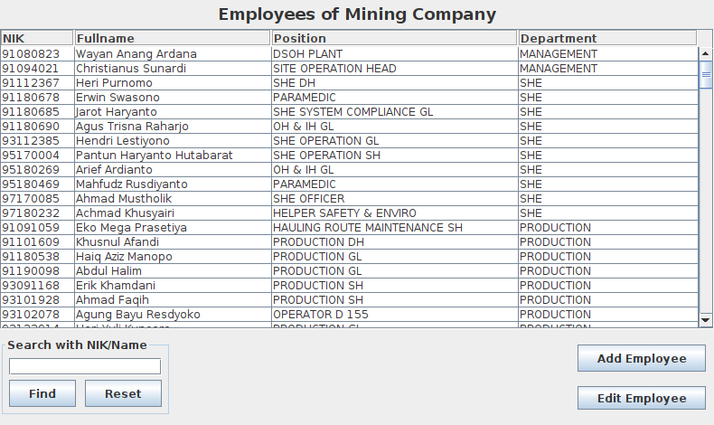
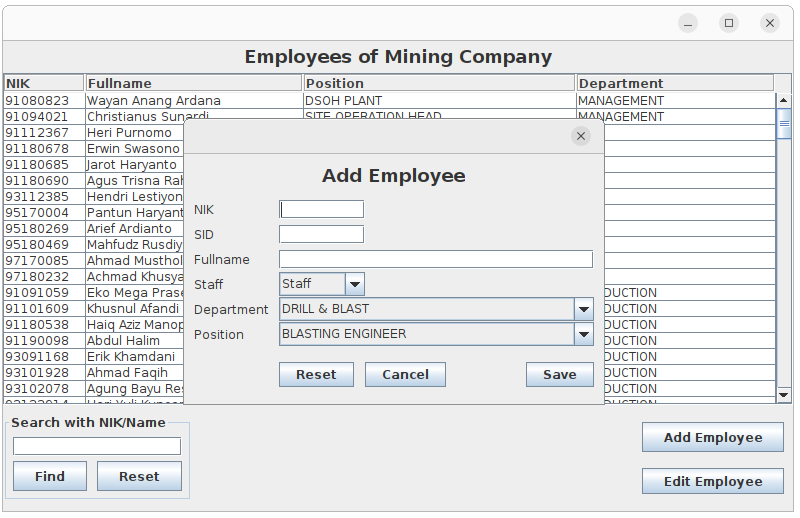
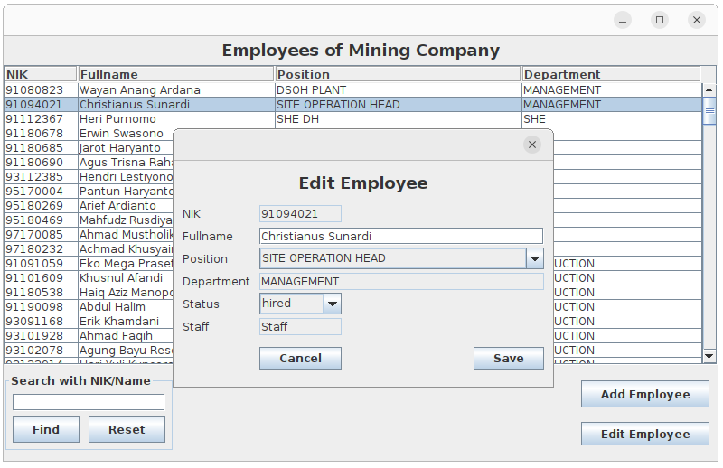
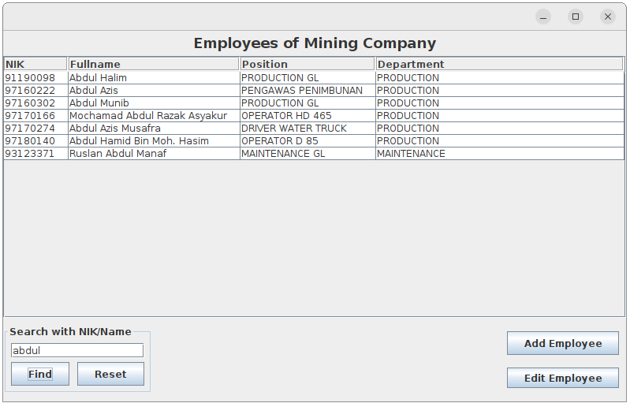

# Employee Database Mining Company

## Create Employee Database

Login to mysql as user root

```sql
CREATE DATABASE MiningEmployee;
CREATE USER 'user1'@'localhost' IDENTIFIED BY 'password1';
GRANT ALL PRIVILEGES ON `MiningEmployee` . * TO 'user1'@'localhost';
EXIT;
```

Then execute sql statements to import file `Mining.sql`.

```sh
mysql -u user1 -p MiningEmployee < MiningEmployee.sql
```

Using password `password1`

## Export CLASSPATH

```sh
export CLASSPATH=lib/json-java.jar:lib/mysql-connector-java-5.1.23-bin.jar:lib/swingx-core-1.6.2.jar:.
```

## Compile

```sh
javac com/mining/program/MainForm.java
```

## Run Application

Run aplikasi
```sh
java com.mining.program.MainForm
```

## Screenshot



This is showing the hired employees only.



Add a New Employee



Edit a Employee



Find an Employee or some Employees based on NIK / Name

