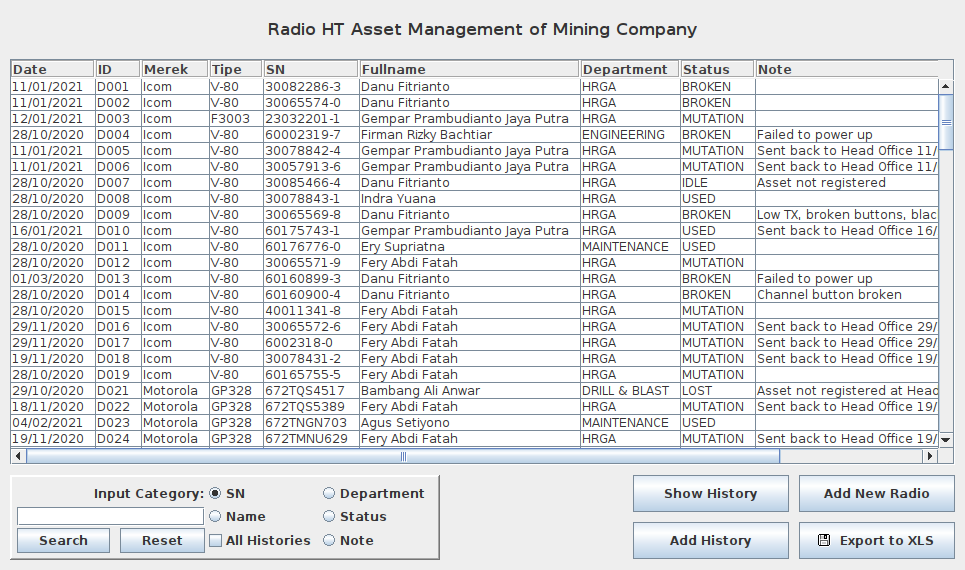
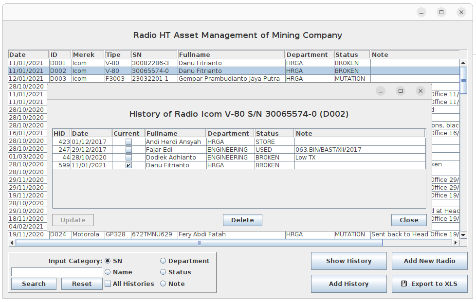
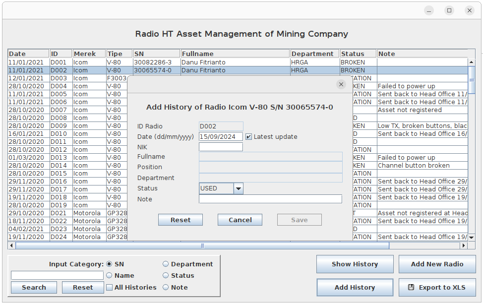
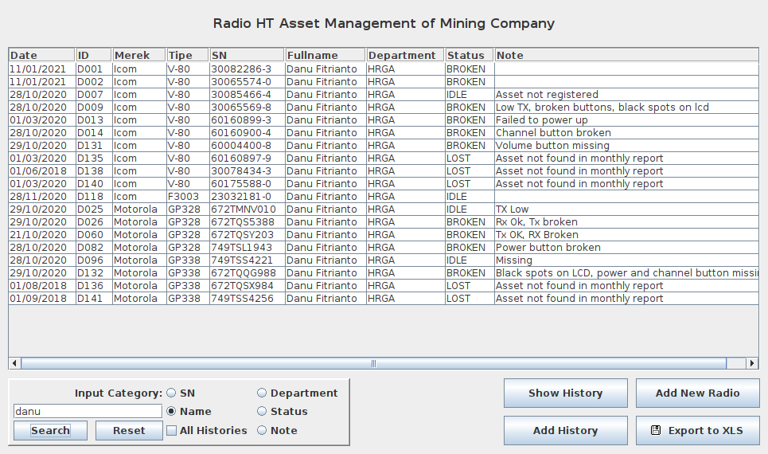
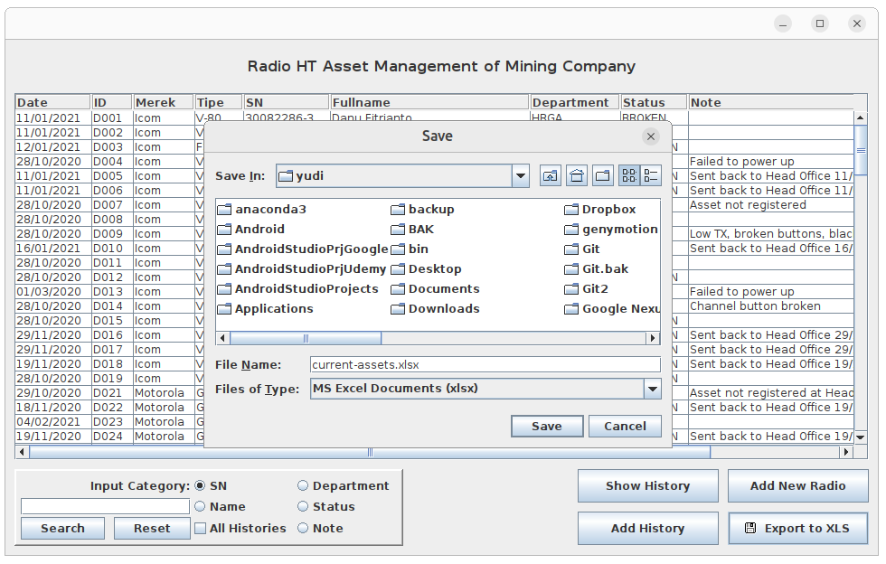

# Asset Management of Mining Company

## Create Database AssetMining

Login to mysql as user root

```sql
CREATE DATABASE AssetMining;
GRANT ALL PRIVILEGES ON `AssetMining` . * TO 'user1'@'localhost';
EXIT;
```

Then execute sql statements to import file `AssetMining.sql`.

```sh
mysql -u root -p AssetMining < AssetMining.sql
```

You must login as user root to import database AssetMining.

## Export CLASSPATH

```sh
export CLASSPATH=lib/json-java.jar:lib/mysql-connector-java-5.1.23-bin.jar:lib/swingx-core-1.6.2.jar:lib/poi-3.11-20141221.jar:lib/poi-ooxml-3.11-20141221.jar:lib/poi-ooxml-schemas-3.11-20141221.jar:lib/xmlbeans-2.6.0.jar:.
```

## Compile

```sh
javac com/mining/program/MainForm.java
```

## Run Application

Run aplikasi
```sh
java com.mining.program.MainForm
```

## Screenshot



Only showing the current posession of the assets.



Select a specific asset then click `Show History` button



Select a specific asset then click `Add history` button



Show which assets once belong to the user in search



Save the belonging of current assets into a xlsx file

