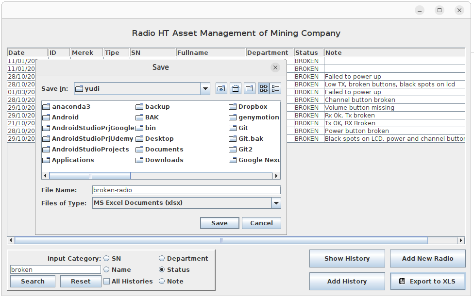

# Asset Management

Asset Management is a GUI Application written in java and swing as GUI toolkit. 
In this project we choose the HT Radio as an asset to manage. In mining companies, 
HT radios are very much needed for communication between employees because the work 
environment generally does not receive signals from cellular operators.

Generally, HT Radios are given to employees who need them most. Radio and borrower 
data is stored in an xlsx file. However, tracking the HT Radio will be complicated 
if you only use a regular xlsx file. An HT Radio will have a long history

- A new radio is stored as an asset by IT
- The radio is borrowed to an employee
- The radio changes ownership
- The radio is damaged
- The radio is sent for repair at a service center
- The radio is transferred to another branch (mutation)
- The radio is lost.

This GUI application will make it easier for IT to monitor the movement of HT radios. 
Reports in the form of xlsx files can be created directly from this application: 

- The current condition of all radio assets
- The number of radios currently borrowed
- The number of damaged radios
- The number of radios still being serviced
- Etc.

Report of broken radios

This project is divided into two sections

## Employee Database Application

Creating a simple Employee Database Application GUI. The operations are

- Add an employee
- Edit an employee

The dismissed employee enter a `terminate` status.

[Employee Database Application](https://github.com/awarmanf/asset_management_gui/tree/master/1_Employee_Database)

## Asset Management Application.

Creating an Asset Management Application GUI. The operations are

- Add an asset (Radio HT)
- Show history of a specific asset
- Add a history for a specific asset
- Searching based on some input
- Report the assets in form of xlsx file

[Asset Management Application](https://github.com/awarmanf/asset_management_gui/tree/master/2_Asset_Management)

